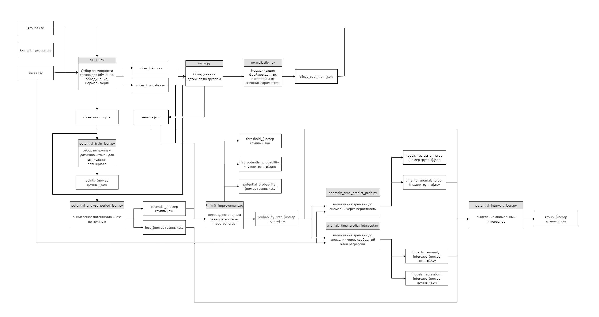

# Potential_multi_group

## Назначение

Набор скриптов реализует метод потенциалов, предназначенный для обнаружения и прогнозирования аномалий в ДТО (диагностируемом техническом оборудовании). Каждый скрипт реализует определенный этап метода потенциалов и запускается последовательно. Для запуска всех скриптов необходим конфигурационный файл json, csv файлы с временными срезами по датчикам и принадлежностью датчика к определенной группе.

### В состав набора входят следующие скрипты:

- SOCHI.py: отбор по мощности срезов для обучения, объединения и нормализации;
- union.py: функции объединения датчиков по группам;
- normalization.py: функции нормализации фреймов данных и отстройки от внешних параметров;
- potential_train_json.py: отбор по группам датчиков и точек для вычисления потенциала;
- potential_analyze_period_json.py: вычисление потенциала и loss по группам;
- P_limit_improvement.py: перевод потенциала в вероятностное пространство;
- anomaly_time_predict_prob.py: вычисление времени до аномалии через вероятность;
- anomaly_time_predict_intercept.py: вычисление времени до аномалии через свободный член регрессии;
- potential_intervals_json.py: выделение аномальных интервалов в формате json;
- store_for_reports.py: автоматический сборщик для формирования входных файлов веб-приложения streamlit;
- potentials_online_clickhouse: онлайн режим метода потенциалов.


### Системные требования 

- pandas~=1.4.3;
- loguru~=0.5.3;
- numpy~=1.23.1;
- matplotlib~=3.5.2;
- scikit-learn~=1.1.1;
- scipy~=1.9.0;
- python-dateutil~=2.8.2;
- clickhouse_connect~=0.5.18.


### Установка пакетов

```
pip install -r requirements.txt
```

## Запуск скриптов

Для офлайн режима скрипты следует выполнять в следующей последовательности:

1) SOCHI.py;
2) potential_train_json.py;
3) potential_analyze_period_json.py;
4) P_limit_improvement.py;
5) anomaly_time_predict_prob.py или anomaly_time_predict_intercept.py;
6) potential_intervals_json.py

Для удобного формирования входных файлов веб-приложения можно запустить скрипт store_for_reports.py

Запуск скриптов можно выполнить без аргументов, так как все необходимые параметры считываются через конфиг:
```
python SOCHI.py
python potential_train_json.py
python potential_analyze_period_json.py
python P_limit_improvement.py
python anomaly_time_predict_prob.py ИЛИ anomaly_time_predict_intercept.py
python potential_intervals_json.py
python store_for_reports.py
```

Для онлайн режима необходимо выполнить:
```
python potentials_online_clickhouse
```

Если в качестве источника исходных данных в конфиге были указаны csv-файлы, то необходимо в директорию `Data` положить следующие файлы:

- файл срезов `slices.csv`;
- файл наименования групп `groups.csv`;
- файл KKS датчиков с их принадлежностью к группам `kks_with_groups.csv`.

### Результаты выполнения скриптов

Последовательность работы скриптов и результаты их работы демонстрирует диаграмма потоков данных 


В результате последовательного выполнения скриптов в директории Data будут появляться директории, содержащие json и csv файлы с результатами работы метода.
В директории json_interval будут сохранены найденные аномальные интервалы; в директориях соответствующих групп появятся csv с вычисленными потенциалами, вероятностями.

### Описание конфигурационного файла config_SOCHI.json:

#### `Предупреждение` - наименование всех сохраняемых и входных файлов лучше не изменять.

Конфигурационный файл json имеет по умолчанию следующие поля:

`station`: наименование станции.

`project_name`: название проекта.

`count_of_groups`: количество групп ДТО.

`number_of_samples`: количество интервалов кратных 5.

`create_online_table`: если 1, то пересоздает и заполняет заново таблицы в БД для онлайн режима; если 0, то записи кладутся в существующую БД.

`source_input_data`: выбор источника входных данных. Следует указать какое-либо одно из следующих трех значений: {"clickhouse", "sqlite", "csv"}.

`N`: отсечка по мощности.

`blacklist_sensors`: массив KKS запрещенных датчиков - эти датчики не участвуют в работе метода.

`approx_sensors`: массив KKS отстраиваемых датчиков. Может содержать два датчика, тогда отстройка будет от двух параметров. Если внесен в массив один датчик, то отстройка идет от одного датчика. В массиве последним `всегда` указывается KKS датчика `мощности`.

`N_l`: количество точек для вычисления потенциала.

`delta`: время назад регрессии при вычислении времени до аномалии.

`s`: интервал взятия среза при вычислении времени до аномалии.

`P_pr`: уставка сигнализации по прогнозируемой вероятности.

`T_pr`: уставка сигнализации по расчетному времени до аномалии.

`delta_tau_P`: выдержка в часах для уставки сигнализации по вероятности.

`delta_tau_T`: выдержка в часах для уставки сигнализации по прогнозируемому времени.

`rolling`: сглаживание в часах.

`original_csv`: наименование csv файла с временными срезами значений датчиков всех групп (используется если `source_input_data`: "csv").

`original_kks`: наименование csv файла с KKS и принадлежностью датчиков группам (используется если `source_input_data`: "csv").

`original_group_csv`: наименование csv файла с номерами групп и их названием (используется если `source_input_data`: "csv").

`json_sensors`: наименование json файла с выделенными скриптом группами ДТО и датчиками.

`csv_truncate_by_power`: наименование csv файла со срезами, прошедшими отсечку по мощности.

`csv_train`: наименование csv файла со срезами для обучения коэффициентов отстройки по мощности.

`coef_train_json`: наименование json файла с коэффициентами регрессии.

`sqlite_norm`: наименование sqlite файла с нормализованными данными.

`points_json`: наименование json файла с отобранными точками (`заполнять без расширения с постфиксом: _`).

`potentials_csv`: наименование csv файла с вычисленными потенциалами (`заполнять без расширения с постфиксом: _`).

`loss_csv`: наименование csv файла с вычисленными loss (`заполнять без расширения с постфиксом: _`).

`probability_csv`: наименование csv файла с рассчитанными вероятностями (`заполнять без расширения с постфиксом: _`).

`table_potential_probability`: наименование csv файла-таблицы распределения потенциала вероятности (`заполнять без расширения с постфиксом: _`).

`threshold_json`: наименование json файла с пороговыми значениями (`заполнять без расширения с постфиксом: _`).

`anomaly_time_prob`: наименование csv файла с вычисленными временем до аномалии через вероятность (`заполнять без расширения с постфиксом: _`).

`save_models_prob`: наименование json файла с коэффициентами регрессии при вычислении времени до аномалии через вероятность (`заполнять без расширения с постфиксом: _`).

`anomaly_time_intercept`: наименование csv файла с вычисленными временем до аномалии через свободный член регрессии (`заполнять без расширения с постфиксом: _`).

`save_models_intercept`: наименование json файла с коэффициентами регрессии при вычислении времени до аномалии через свободный член регрессии (`заполнять без расширения с постфиксом: _`).

`intervals_json`: наименование json файла с выделенными аномальными интервалами (`заполнять без расширения с постфиксом: _`).

`clickhouse`: объект содержит запросы к БД clichouse в случае выбора этой БД в качестве источника входных данных в поле `source_input_data`:

- `original_csv_query`: запрос на получение временных срезов из clichouse;

- `original_kks_query`: запрос на получение KKS датчиков и принадлежностей их к группам из clichouse;

- `original_group_query`: запрос на получение наименования всех групп из clichouse.

`sqlite`: объект содержит запросы к БД sqlite в случае выбора этой БД в качестве источника входных данных в поле `source_input_data`:

- `original_csv`: наименование sqlite файла, содержащего временные срезы;

- `original_csv_query`: запрос на получение временных срезов из sqlite;

- `original_kks`: наименование sqlite файла, содержащего KKS датчиков и группы;

- `original_kks_query`: запрос на получение KKS датчиков и принадлежностей их к группам из sqlite;

- `original_group`: наименование sqlite файла, содержащего наименования всех групп;

- `original_group_query`: запрос на получение наименования всех групп из sqlite.

`hist_potential_probability`: наименование png файла с гистограммой распределения потенциала и вероятности (`заполнять без расширения с постфиксом: _`).


## Описание метода потенциалов

### Офлайн режим работы

1. Определяется обучающий период по отсечке мощности `N`. Срезы, в момент времени которых мощность была меньше значения `N`, исключаются из обучающего периода;
2. Выполняется отстройка от внешних параметров методом наименьших квадратов  по точкам из обучающего периода. После аппроксимации линейной регрессией (в зависимости от указанных в конфигурационном файле датчиков) отстройка вычитается из исходных данных по каждому датчику;
3. Выполняется нормализация данных методом Z-масштабирования по точкам из обучающего периода;
4. Формируется базовое множество точек пространства признаков для каждой группы датчиков;
5. По каждой группе вычисляется потенциал и loss;
6. По каждой группе осуществляется перевод потенциала в вероятностное пространство с сохранением таблиц распределений потенциала и вероятности, которые необходимы в дальнейшем для онлайн режима работы;
7. По каждой группе вычисляется время до аномалии на всех моментах времени из исходных срезов данных. Предварительно значения вероятности сглаживаются методом скользящего среднего. Возможно вычисление времени до аномалии двумя способами: через значение вероятности или свободный член регрессии. Если момент времени не был выделен в обучающий период, то для этого момента времени происходит заморозка значений потенциала и вероятности. Также определяются моменты времени срабатывания сигнализаций по вероятности и "времени до неисправности";
8. В каждой группе определяются аномальные интервалы.

### Онлайн режим работы

1. Осуществляется импорт необходимых библиотек и модулей;
2. Из конфигурационного файла считываются параметры модели;
4. Инициализируются словари KKS датчиков, точек, таблиц распределения потенциала-вероятности, счетчиков выдержки сигнализаций, критериев срабатывания сигнализаций и окна регрессии по ключу группы;
5. Выполнение функции `kks_online_mode(approxlist, group)`: добавление KKS датчиков в словарь по ключу группы;
6. Выполнение функции `points_load_online_mode(group)`: добавление точек, определенных на этапе обучения, в словарь по ключу группы;
7. Выполнение функции `potential_probability_load_online_mode(group)`: добавление таблиц потенциал-вероятность, определенных на этапе обучения, в словарь по ключу группы;
8. При необходимости согласно выставленным настройкам в конфигурационном файле запускается процедура create_online_table(), создающая таблицы в БД;
9. Запуск онлайн режима с помощью процедуры `online_sochi()` до остановки пользователем скрипта:
		9.1. Инициализация подключения к БД clickhouse;
		9.2. Запрос к БД на получение ненормализованной и необъединенной последней строки из таблицы;
		9.3. Отсечка по мощности строки:
				- если мощность в полученной строке меньше выставленной в конфиге, то потенциал, loss и вероятность будут заморожены;
				- иначе выполняется объединение, отстройка и нормализация полученной строки данных.
		9.4. Для каждой группы определяется потенциал и loss с помощью функции `potentials_analyse_online_mode(data, nums, points)`. Если из-за значения мощности строку следует заморозить, то из БД запрашивается предпоследняя строка с потенциалом, loss и вероятностью, которая становится замороженной строкой;
		9.5. Вычисление времени до аномалии;
		9.6. Запись в таблицы БД loss по датчикам группы и потенциала, вероятности, времени до аномалии, сигнализаций KrP и KrT.
10. Остановка работы скрипта или повторение пункта 9 алгоритма.

### Changelog

v: 1.0.1
	- в скрипт нахождения интервалов potential_intervals_json.py добавлена опция выбора метода -m (--method), которым производилось вычисление времени до аномалии;
	- рефакторинг аргументов командной строки во всех остальных скриптах. Убраны лишние опции.

